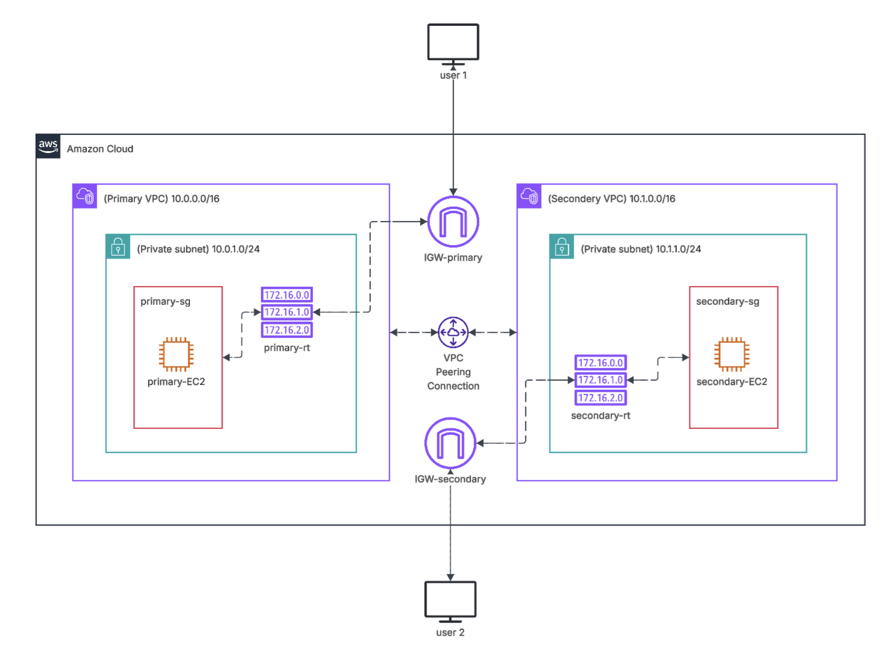
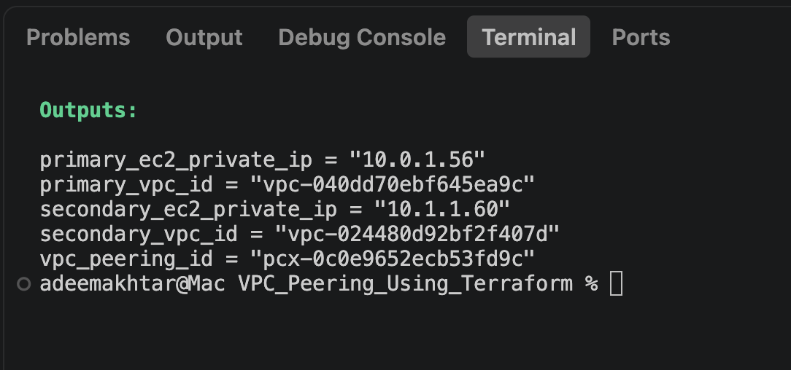

# AWS_Multi-VPC_Architecture_with_VPC_Peering_Using_Terraform
I’m excited to share another hands-on AWS infrastructure project that I have successfully completed using Terraform.
The goal of this project was to build and automate a multi-VPC AWS architecture, while enabling secure communication between resources in separate VPCs.

## Architecture

The solution includes:
* Primary VPC — 10.0.0.0/16
* Secondary VPC — 10.1.0.0/16
* Private subnets in both VPCs
* EC2 instances deployed in each VPC
* Internet Gateways for both VPCs
* Separate Route Tables
* Security Groups for EC2 instances
* VPC Peering connection between the two VPCs
* User access through the respective Internet Gateways
* Routing configured to allow communication between the VPCs

## Why Terraform?
Instead of manually creating and configuring AWS resources through the console, I used Infrastructure as Code (IaC) with Terraform.
This allowed me to:
✅ Automate infrastructure deployment
✅ Define networking configuration as code
✅ Create repeatable environments
✅ Manage dependencies between AWS resources
✅ Reduce manual configuration errors
✅ Make infrastructure easier to maintain and version-control

## How it works
Users can access the respective environments through their VPC Internet Gateways, while the two VPCs communicate internally through the VPC Peering Connection.
The route tables in each VPC contain routes for the opposite VPC CIDR, ensuring that traffic destined for the other VPC is directed through the peering connection.
Key Learning Outcomes
This project strengthened my practical understanding of:
* AWS VPC networking
* CIDR and subnet design
* Route tables and routing
* Internet Gateways
* VPC Peering
* EC2 networking
* Security Groups
* Terraform resource dependencies
* Infrastructure as Code
* AWS architecture troubleshooting

Most importantly, I gained experience thinking about how AWS networking components work together, rather than configuring each service in isolation.

# Implementation

## Prerequisites

Before deploying this project, ensure you have:

* AWS Account
* AWS CLI
* Terraform
* Git
* AWS IAM credentials/profile
* EC2 SSH key pair
* Basic understanding of AWS networking

## Clone the this repo in your system
git clone [https://github.com/AdeemAkhtar/AWS_Multi-VPC_Architecture_with_VPC_Peering_Using_Terraform]

## Navigate to the cloned folder
cd AWS_Multi-VPC_Architecture_with_VPC_Peering_Using_Terraform

## Initialise Terraform
terraform init

## Format Terraform Files
terraform fmt -recursive

## Validate Terraform Configuration
terraform validate

## Review Terraform Plan
terraform plan

## Deploy Infrastructure
terraform apply --auto-approve

## Terraform Outputs
terraform output

Useful Terraform outputs can include:

output "primary_vpc_id" { 
    value = aws_vpc.primary_vpc.id
} 

output "secondary_vpc_id" { 
    value = aws_vpc.secondary_vpc.id
} 

output "primary_ec2_private_ip" { 
    value = aws_instance.primary_instance.private_ip
} 

output "secondary_ec2_private_ip" { 
    value = aws_instance.secondary_instance.private_ip
} 

output "vpc_peering_id" { 
    value = aws_vpc_peering_connection.primary_to_secondary.id
}

Results:

## Connectivity Testing
After connecting to the EC2 instances, test communication using their private IP addresses.

### From the Primary EC2:
ping <SECONDARY_PRIVATE_IP>

### From the Secondary EC2:
ping <PRIMARY_PRIVATE_IP>

## Destroy Infrastructure
terraform destroy --auto-approve

# Key Learning Outcomes

Through this project, I gained practical experience with:

* AWS VPC architecture
* CIDR addressing
* Subnet design
* Route Tables
* Internet Gateways
* Security Groups
* EC2 networking
* VPC Peering
* Private IP communication
* Terraform Infrastructure as Code
* Terraform resource dependencies
* Infrastructure validation
* AWS networking troubleshooting